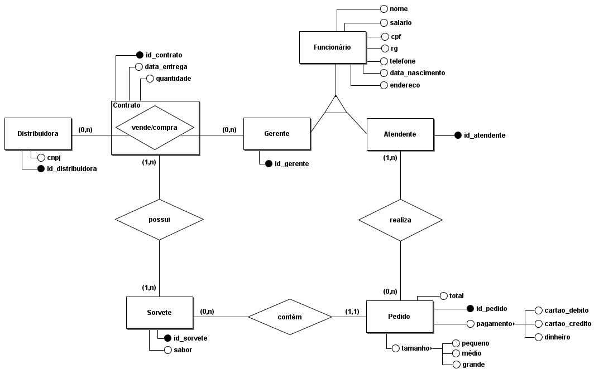

# Trabalho 2 Banco de Dados - 2021.1

## Nome: Daniella Martins Vasconcellos

**Enunciado:** *"Este trabalho visa utilizar uma API Relacional para criar uma aplicação simples.Sua aplicação não precisará utilizar todo o banco de dados. Isto significa que você poderá utilizar duas tabelas apenas [do trabalho anterior], desde que elas estejam relacionadas.*

*Sua aplicação deverá conter:*

- *Uma opção para inserir novas tuplas da primeira tabela;*

- *Uma opção para inserir novas tuplas da segunda tabela;*

- *Uma opção para listar todas as tuplas da primeira tabela;*

- *Uma opção para listar todas as tuplas da segunda tabela;*

- *Uma opção para listar o resultado de uma consulta que envolva uma junção entre as duas tabelas;*

- *Uma opção para listar o resultado de uma consulta que envolva subconsulta(s) e uma ou mais funções de agregação."*

---

**Link para o vídeo explicativo: [Clique aqui](https://drive.google.com/file/d/1EFaXhGyExWYkswtc7UOrP7lJGFZAz7yU/view?usp=sharing)**

---

Tendo em vista os comentários da professora Rebeca referentes ao primeiro esquema lógico conceitual (na pasta ''trab1'' deste mesmo repositório), as seguintes alterações foram feitas:

- À entidade Pedido, foi adicionado uma variável ''total'', que simboliza o valor total pago na compra;
- O relacionamento ''venda/compra'' foi transformado em uma entidade associativa de mesmo nome, que também possui um contrato com as seguintes características: *id_contrato*, *data_entrega*, *quantidade*, todos referentes ao contrato estabelecido entre a distribuidora e o gerente da sorveteria;
- As derivações das variáveis ''tamanho'' e ''pagamento'' anteriormente eram *booleans*, e agora são *Strings* para facilitação do trabalho do banco.

